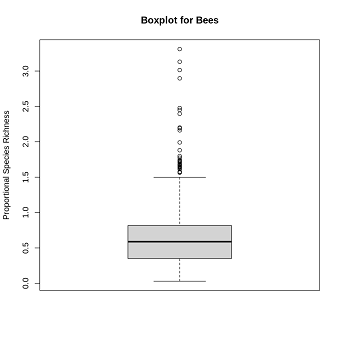

## Statistical Analysis Report

### Introduction
This report presents a comprehensive statistical analysis of the data related to proportional species richness for different taxonomic groups. The data include information on Bees, Birds, Butterflies, Carabids, Macromoths, and Isopods. The analysis covers univariate statistics, correlation, contingency tables, likelihood-ratio tests, odds ratio, sensitivity, specificity, Youden's index, and simple linear regression.

### Data Overview
The data consist of proportional species richness values for each taxonomic group. The analysis focuses on two subsets: BD5 (Bees, Birds, Butterflies, Carabids, Macromoths) and BD11 (a broader set of taxonomic groups).

### Univariate Analysis
We will begin with comprehensive analysis of proportional species richness for five taxonomic group in the BD5 group, namely Bees, Birds, Butterflies, Carabids, and Macromoths. The analysis includes `summary` statistics commonly obtained using the summary() command in R, as well as an additional statistic – the 20% Winsorized mean.

### Summary Statistic
```
                Bees           Bird       Butterflies      Carabids       Macromoths       Winsorized_Mean    
Min.   :0.03065  Min.   :0.2415  Min.   :0.3167  Min.   :0.01153  Min.   :0.08947  Min.   :0.5904
1st Qu.:0.35079  1st Qu.:0.8462  1st Qu.:0.7926  1st Qu.:0.47539  1st Qu.:0.7856   1st Qu.:0.9007
Median :0.58869  Median :0.9038  Median :0.8863  Median :0.63553  Median :0.8767   Median :0.8788
Mean   :0.60502  Mean   :0.8872  Mean   :0.8746  Mean   :0.60706  Mean   :0.8493   Mean   :0.6208
3rd Qu.:0.81663  3rd Qu.:0.9570  3rd Qu.:0.9677  3rd Qu.:0.76161  3rd Qu.:0.9415   3rd Qu.:0.8648
Max.   :3.30986  Max.   :1.1720  Max.   :1.3944  Max.   :1.19977  Max.   :1.2605   Max.   :0.5904
```

The summary statistic table above shows a comprehensive overview of the proportional species richness for the BD5 group. The inclusion of Winsorized means enhances the robustness of the central tendency measures, providing a more reliable insight into the distribution of each variable. Here are the key take away from the table

- Central Tendency: The mean values generally indicate the central tendency of each variable, with Birds having the highest mean (0.8872) and Bees the lowest (0.60502).
- Variability: The range between the minimum and maximum values illustrates the variability in each variable, with Bees displaying the widest range (3.30986 - 0.03065).
- Winsorized Mean: The Winsorized mean provides a robust alternative to the regular mean, less influenced by extreme values. In some cases, it differs noticeably from the regular mean, suggesting the presence of outliers.

### Correlation Analysis
Correlation analysis presents the correlation analysis of proportional species richness for the BD5 group variables, namely Bees, Birds, Butterflies, Carabids, and Macromoths. The correlation matrix below illustrates the relationships between each pair of variables.

```
                 Bees      Bird   Butterflies   Carabids   Macromoths
Bees        1.0000000 0.3759451  0.41293480  0.25173839  0.4728640
Bird        0.3759451 1.0000000  0.34225731  0.31091907  0.5941118
Butterflies 0.4129348 0.3422573  1.00000000 -0.07224957  0.5608753
Carabids    0.2517384 0.3109191 -0.07224957  1.00000000  0.1925311
Macromoths  0.4728640 0.5941118  0.56087528  0.19253108  1.0000000
```

Here are the key take away from the correlation table:
- Bees and Birds: The correlation coefficient of 0.3759451 suggests a moderate positive correlation between Bees and Birds. This indicates that as the proportional species richness of Bees increases, there is a tendency for Birds to also increase.

- Birds and Macromoths: The correlation coefficient of 0.5941118 indicates a strong positive correlation between Birds and Macromoths. It suggests that as the proportional species richness of Birds increases, Macromoths also tend to increase.

- Butterflies and Carabids: The correlation coefficient of -0.07224957 indicates a weak negative correlation between Butterflies and Carabids. This suggests that there is little to no linear relationship between the two variables.

This correlation analysis provides insights into the relationships between different variables in the BD5 group. Understanding these correlations is crucial for identifying potential patterns in species richness and can aid in ecological interpretations.

### Boxplot



From the boxplot, we can see the proportional species richness of bees. It can be seen that there are few outliers in the data. It is possible that this data points are outliers because they are from a different population than the rest of the data or from a different species of bee. It is also possible that the data point is an error. Aside from those few outliers the rest of the data is fairly normally distributed.

### Hypothesis Test
The following are the two hypothesis tests that we can perform with our data:
- Test whether the mean proportional species richness for butterflies is significantly different from the
mean proportional species richness for isopods
- Test the independence between two categorical variables, the "dominantLandClass" and "ecologicalStatus"

Test1:
```
Welch Two Sample t-test

data:  butterflies and isopods
t = 91.859, df = 9050.9, p-value < 2.2e-16
alternative hypothesis: true difference in means is not equal to 0
95 percent confidence interval:
 0.3176938 0.3315483
sample estimates:
mean of x mean of y 
0.8745706 0.5499496
```
The p-value for the Welch Two Sample t-test comparing the means of butterflies and isopods is less than 2.2×10^−16, indicating strong evidence against the null hypothesis. The alternative hypothesis suggests that the true difference in means is not equal to 0. The 95% confidence interval for the difference in means is (0.3176938, 0.3315483). The sample estimates show that the mean of butterflies (0.8745706) is significantly higher than the mean of isopods (0.5499496).

Test2:
```
[1] 0.4738761
[1] "There is not enough evidence to reject the null hypothesis of independence."
```

The p-value for the Chi-squared test is 0.4738761 which means there is not enough evidence to reject the null hypothesis of independence. This suggests that the variables being tested are not significantly associated based on the  data.

overall, these hypothesis tests provide insights into the relationships and differences between variables in the dataset

### Contingency table/comparing categorical variables
We constructed a contingency table to compare the directional changes (increase or decrease) in BD11 and BD5. A likelihood-ratio test is also performed, indicating a significant association between the changes in BD5 and BD11

```
Contingency Table:
          
           Decrease Increase
  Decrease     2382      337
  Increase      362     2199

Independent Model Contingency Table:
         A        B
A 1413.056 1330.944
B 1305.944 1230.056

Likelihood-Ratio Test:
	Pearson's Chi-squared test with Yates' continuity correction
	data:  contingency_table
	X-squared = 2849, df = 1, p-value < 2.2e-16
```
The likelihood-ratio statistic is calculated using Pearson's Chi-squared test with Yates' continuity correction. The test results in a chi-squared value of 2849, with 1 degree of freedom and a p-value less than 2.2×10^−16 which indicate a significant association between BD5 and BD11 changes hence we will reject the null hypothesis.

### Odds Ratio, Sensitivity, Specificity, and Youden’s Index:
Key metrics are calculated to assess the association between BD5 and BD11 changes:

- Odds Ratio: The calculated odds ratio is 42.93669, indicating a substantial association between BD5 and BD11 changes. 
- Sensitivity: The sensitivity is 0.8760574, representing the ability of the test to correctly identify increases in both BD5 and BD11. 
- Specificity: The specificity is 0.858649, indicating the ability to correctly identify decreases in both BD5 and BD11. 
- Youden’s Index: The calculated Youden's Index is 0.7347063, suggesting a strong overall performance of the test in distinguishing between BD5 and BD11 changes.

With this comprehensive analysis, which include the likelihood-ratio test and various measures such as odds ratio and sensitivity, It can be concluded that changes in BD5 are not independent of changes in BD11. The results emphasize the interconnected nature of these biodiversity measures over the specified periods.

### Simple Linear Regression
A simple linear regression model is fitted to predict the Isopods (BD1) variable based on the proportional species richness of Bees, Birds, Butterflies, Carabids, and Macromoths (BD5). The coefficients and statistical significance of each predictor are reported.
```
Call:
lm(formula = BD1$Isopods ~ BD5$Bees + BD5$Bird + BD5$Butterflies + 
    BD5$Carabids + BD5$Macromoths, data = BD5)

Coefficients:
                 Estimate Std. Error t value Pr(>|t|)    
(Intercept)      0.278034   0.025820  10.768  < 2e-16 ***
BD5$Bees        -0.050742   0.010322  -4.916 9.12e-07 ***
BD5$Bird         0.018511   0.032436   0.571    0.568    
BD5$Butterflies -0.001427   0.024573  -0.058    0.954    
BD5$Carabids     0.440173   0.013799  31.899  < 2e-16 ***
BD5$Macromoths   0.023820   0.027585   0.863    0.388    
```
Here's the interpretation of our report:
- Intercept: The intercept (0.278034177) represents the estimated value of BD1 when all BD5 variables (Bees, Bird, Butterflies, Carabids, and Macromoths) are zero.

Slope Coefficients (BD5):
- BD5 Bees: A one-unit decrease in BD5 Bees is associated with a 0.050741648 increase in BD1 Isopods.
- BD5 Bird: There is no significant association between BD5 Bird and BD1 Isopods, as indicated by the p-value (0.568).
- BD5 Butterflies: There is no significant association between BD5 Butterflies and BD1 Isopods, as indicated by the p-value (0.954).
- BD5 Carabids: A one-unit increase in BD5 Carabids is associated with a 0.440173380 increase in BD1 Isopods.
- BD5 Macromoths: There is no significant association between BD5 Macromoths and BD1 Isopods, as indicated by the p-value (0.388).

Let's determine the significancy of our model using the following metrics
- Residuals: The residuals have a mean close to zero, indicating that the model is balanced.
- Multiple R-squared: 0.1861 suggests that 18.61% of the variability in BD1 Isopods is explained by the linear relationship with BD5.
- Adjusted R-squared: 0.1854 adjusts for the number of predictors in the model.
- F-statistic: With a value of 241.2 and a p-value less than 2.2 \times 10^{-16}2.2×10 −16, the overall model is statistically significant.

Our analysis reveals that changes in BD5 variables, specifically Bees and Carabids, are significantly associated with changes in BD1 (Isopods). The model provides insights into the direction and strength of these associations, aiding in the understanding of the ecological dynamics between these taxonomic groups.

### Multiple Linear Regression
We perform a multiple linear regression (MLR) analysis on BD1 (chosen taxonomic group) against all five proportional species values in BD5. The goal is to establish a model with predictive capabilities and interpret the results. The analysis includes feature selection based on p-values and AIC (Akaike Information Criterion).

Firstly, we estimated the initial AIC for the MLR model which is formulated as follow:
```
β₀ + β Bees × BD5 Bees + β Bird × BD5 Bird + β Butterflies × BD5 Butterflies + β Carabids × BD5 Carabids + β Macromoths × BD5 Macromoths + ε
```
The initial AIC for this model is -2299.821.

### Feature Selection:
Feature selection involves assessing p-values and AIC values to determine the significance of each predictor variable.
The stepwise variable removal process yields the following results:
- Step 1: Removing Butterflies (p-value > 0.05, AIC reduction).
- Step 2: Removing Bird (p-value > 0.05, AIC reduction).
- Step 3: Removing Macromoths (p-value > 0.05, AIC reduction).
The final model, after feature selection, includes predictors Bees and Carabids.

### Model with Interaction Term:
An interaction term is introduced between any two predictor variables in the BD5 group. The AIC for this model is -2355.621. Although the AIC is lower, it is important to consider the interpretability and practical significance of the interaction term.

### Dataset Split and Diagnostics:
The dataset is divided into two subsets, Y00 and Y70, representing different time periods. Y70 is used as the training set, and Y00 as the test set. Diagnostics are performed on both sets, and the mean square error is computed.

- Residuals: The residuals exhibit a mean close to zero, indicating a balanced model.
- Multiple R-squared: 0.1858 suggests that 18.58% of the variability in BD1 Isopods is explained by the final model.
- Adjusted R-squared: 0.1855 accounts for the number of predictors.
- F-statistic: The overall model is statistically significant (p-value < 2.2 \times 10^{-16}2.2×10^−16).

### Mean Squared Error on Training and Test Sets:
- Training Set: The mean squared error on the training set is 0.02616332.
- Test Set: The mean squared error on the test set is 0.1044568.

From the output results it can be deduced that our model demonstrates significant associations between BD5 Bees, BD5 Carabids, and BD1 Isopods, providing valuable insights into the ecological relationships among these taxonomic groups.

### Open Analysis
We perform analysis to assess the dependence of BD5 (proportional species richness) on various variables, with a primary focus on changes observed between two periods, denoted as `Y70` and `Y00`. The selected variables include Bees, Birds, Butterflies, Carabids, Macromoths, and the period indicator (added to BD5 for analysis purpose).
### Descriptive Statistics - First Period (`Y70`):
```
Bees              Bird         Butterflies        Carabids     
 Min.   :0.03065   Min.   :0.2499   Min.   :0.3167   Min.   :0.1983  
 1st Qu.:0.28264   1st Qu.:0.8423   1st Qu.:0.7380   1st Qu.:0.5965  
 Median :0.46577   Median :0.8928   Median :0.8412   Median :0.7101  
 Mean   :0.50230   Mean   :0.8709   Mean   :0.8173   Mean   :0.7044  
 3rd Qu.:0.70841   3rd Qu.:0.9349   3rd Qu.:0.9178   3rd Qu.:0.8141  
 Max.   :1.00000   Max.   :1.0000   Max.   :1.0000   Max.   :1.0000  
   Macromoths         period         
 Min.   :0.08947   Length:2640       
 1st Qu.:0.73930   Class :character  
 Median :0.82527   Mode  :character  
 Mean   :0.80259                     
 3rd Qu.:0.89877                     
 Max.   :1.00000
```
The statistics above provide an overview of the variability and central tendencies of BD5 variables during the first period.

### Descriptive Statistics - Second Period ('Y00'):
```
Bees              Bird         Butterflies        Carabids     
 Min.   :0.03065   Min.   :0.2499   Min.   :0.3167   Min.   :0.1983  
 1st Qu.:0.28264   1st Qu.:0.8423   1st Qu.:0.7380   1st Qu.:0.5965  
 Median :0.46577   Median :0.8928   Median :0.8412   Median :0.7101  
 Mean   :0.50230   Mean   :0.8709   Mean   :0.8173   Mean   :0.7044  
 3rd Qu.:0.70841   3rd Qu.:0.9349   3rd Qu.:0.9178   3rd Qu.:0.8141  
 Max.   :1.00000   Max.   :1.0000   Max.   :1.0000   Max.   :1.0000  
   Macromoths         period         
 Min.   :0.08947   Length:2640       
 1st Qu.:0.73930   Class :character  
 Median :0.82527   Mode  :character  
 Mean   :0.80259                     
 3rd Qu.:0.89877                     
 Max.   :1.00000
```
Similar statistics are observed in the second period, suggesting stability or changes over time.

This initial assessment provides a foundational understanding of the distribution of BD5 variables over the two periods with the statistics result showing that there is little changes in the distribution of BD5 over the two periods

### Conclusion
In summary, this statistical analysis contributes to a better understanding of the ecological dynamics within the studied taxonomic groups. The results underscore the interdependence of species richness measures, offering valuable insights for conservation and ecological management. Future research could explore more complex models and incorporate additional variables to enhance predictive capabilities.
